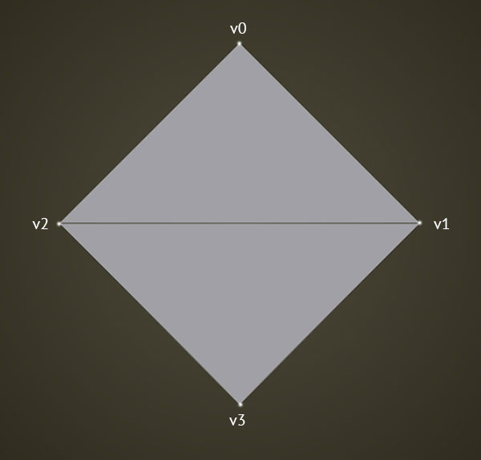

Add an index to the index vector. Each index represents the order of connection for  vertices. This determines the way that the vertices are connected according to the polygon type set in the primitiveMode. It important to note that a particular vertex might be used for several faces and so would be referenced several times in the index vector.
```cpp
    ofMesh mesh;
    mesh.setMode(OF_PRIMITIVE_TRIANGLES);
    mesh.addVertex(ofPoint(0,-200,0));
    mesh.addVertex(ofPoint(200, 0, 0 ));
    mesh.addVertex(ofPoint(-200, 0, 0 ));
    mesh.addVertex(ofPoint(0, 200, 0 ));
    mesh.addIndex(0); //connect the first vertex we made, v0
    mesh.addIndex(1); //to v1
    mesh.addIndex(2); //to v2 to complete the face
    mesh.addIndex(1); //now start a new face beginning with v1
    mesh.addIndex(2); //that is connected to v2
    mesh.addIndex(3); //and we complete the face with v3
```

Will give you this shape:

