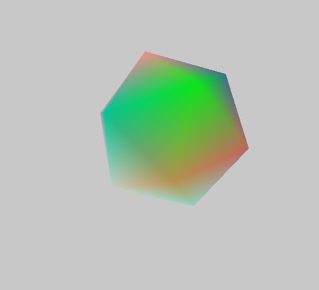

First things first: a Vertex Buffer Object (VBO) provides a way for you to create vertices, normals, colors, and texture coordinates on the graphics card for non-immediate mode rendering. This means that you can store it all on the graphics card and then access, update, or draw it, whenever you need. This is pretty convenient when you have something that you want to draw multiple times without changing it much, because it means that, instead of needing to upload new data each time, you can simply draw it without needing to recreate all your vertices and colors, a philosophy which is probably familiar to you from working with the ofFbo or ofTexture.

There are a few things that are important to understand about VBOs:

Each property of the VBO - vertices, texCoords, normals, colors - can be either dynamic or static. You set it to static when you know that you won't be updating it later on. You set it to dynamic when you know you will be updating it later on.

Just like with ofMesh, you need to keep track of the vertices and their indices in order to make shapes and you can draw a VBO in any one of the OpenGL drawing modes, GL_LINE_STRIP, GL_POINTS, GL_QUADS, GL_TRIANGLES and GL_TRIANGLE_STRIP.

Vertices are passed to your graphics card and your graphics card fills in the spaces in between them in a process usually called the rendering pipeline. The rendering pipeline goes more or less like this:

1. Say how you're going to connect all the points.

2. Make some points.

3. Say that you're done making points.

You may be thinking: Ill just make eight vertices and voila: a cube. Not so quick. Theres a hitch and that hitch is that the OpenGL renderer has different ways of connecting the vertices that you pass to it and none are as efficient as to only need eight vertices to create a cube. You've probably seen a version of the following image somewhere before.


Generally, you have to create your points to fit the drawing mode that you've selected because of whats called winding. A vertex gets connected to another vertex in the order that the mode does its winding and this means that you might need multiple vertices in a given location to create the shape you want. The cube, for example, requires eighteen vertices, not the eight that you would expect. If you note the order of vertices in the GL chart above you'll see that all of them use their vertices slightly differently (in particular you should make note of the GL_TRIANGLE_STRIP example). Drawing a shape requires that you keep track of which drawing mode is being used and which order your vertices are declared in. If you're thinking it would be nice if there were an abstraction layer for this, you're thinking right. Enter the mesh, which is really just an abstraction of the vertex and drawing mode that we started with but which has the added bonus of managing the draw order for you. That may seem insignificant at first, but it provides some real benefits when working with complex geometry.

The following example shows an ofVbo representing an icosahedron:

```cpp
const ofIndexType Faces[] = {
    2, 1, 0,
    3, 2, 0,
    4, 3, 0,
    5, 4, 0,
    1, 5, 0,
    11, 6,  7,
    11, 7,  8,
    11, 8,  9,
    11, 9,  10,
    11, 10, 6,
    1, 2, 6,
    2, 3, 7,
    3, 4, 8,
    4, 5, 9,
    5, 1, 10,
    2,  7, 6,
    3,  8, 7,
    4,  9, 8,
    5, 10, 9,
    1, 6, 10 };
const float Verts[] = {
    0.000f,  0.000f,  1.000f,
    0.894f,  0.000f,  0.447f,
    0.276f,  0.851f,  0.447f,
    -0.724f,  0.526f,  0.447f,
    -0.724f, -0.526f,  0.447f,
    0.276f, -0.851f,  0.447f,
    0.724f,  0.526f, -0.447f,
    -0.276f,  0.851f, -0.447f,
    -0.894f,  0.000f, -0.447f,
    -0.276f, -0.851f, -0.447f,
    0.724f, -0.526f, -0.447f,
    0.000f,  0.000f, -1.000f };
ofVec3f v[12];
ofVec3f n[12];
ofFloatColor c[12];
ofVbo vbo;
void HelloWorldApp::setup()
{
    int i, j = 0;
    for ( i = 0; i < 12; i++ )
    {

        c[i].r = ofRandom(1.0);
        c[i].g = ofRandom(1.0);
        c[i].b = ofRandom(1.0);

        v[i][0] = Verts[j] * 100.f;
        j++;
        v[i][1] = Verts[j] * 100.f;
        j++;
        v[i][2] = Verts[j] * 100.f;
        j++;

    }

    vbo.setVertexData( &v[0], 12, GL_STATIC_DRAW );
    vbo.setColorData( &c[0], 12, GL_STATIC_DRAW );
    vbo.setIndexData( &Faces[0], 60, GL_STATIC_DRAW );

    glEnable(GL_DEPTH_TEST);
}
void HelloWorldApp::draw(){
    ofTranslate(ofGetWidth()/2, ofGetHeight()/2, 100);
    ofRotate(ofGetElapsedTimef() * 20.0, 1, 1, 0);
    glPointSize(10.f);
    vbo.drawElements( GL_TRIANGLES, 60);
}
```



You'll notice in a lot of the methods that a usage is required, for instance, setNormals(). The possible options are: GL_STREAM_DRAW, GL_STREAM_READ, GL_STREAM_COPY, GL_STATIC_DRAW, GL_STATIC_READ, GL_STATIC_COPY, GL_DYNAMIC_DRAW, GL_DYNAMIC_READ, or GL_DYNAMIC_COPY Each of these affects the speed of operations that you perform with the VBO and whether it's certain operations are allowed. For instance, if the vertices are STATIC, then they cannot be changed after they been loaded the first time, whereas if they're DYNAMIC, then they can be modified at any time later. The different modes can be broken down like so:

STREAM
The data store contents will be modified once and used at most a few times.

STATIC
The data store contents will be modified once and used many times.

DYNAMIC
The data store contents will be modified repeatedly and used many times.

The nature of access may be one of these:

DRAW
The data store contents are modified by the application, and used as the source for GL drawing and image specification commands.

READ
The data store contents are modified by reading data from the GL, and used to return that data when queried by the application.

COPY
The data store contents are modified by reading data from the GL, and used as the source for GL drawing and image specification commands.
